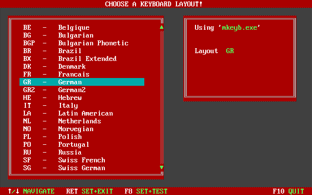

# SET_KBD.COM - a DOS keyboard layout chooser 
 
This tool lets you choose from a list of available keyboard layouts and uses a keyboard-tool to set the layout. 
It can be configured with a simple text file to use different keyboard tools and layouts. 

This tool is very small and it's intention is to use it on boot floppies etc.
 
# screenshot 

# usage
```
X:\...\> SET_KBD.COM CONFIG.CFG
```
# configuration file 

This folder contains two sample configurations for different keyboard tools:
* `mkeyb.exe` from Tom Ehlert (`mkeyb.cfg`)
* `keyb.com` from MS-DOS 6.22 (`mskeyb.cfg`)

If you want to use any other keyboard tool, you must write your own cfg-file. If send it back to me, I will add it here. 
The first line is the path to the keyboard tool. All other lines are list entries. An entry looks like this:
```
GR;GR;German
```
The first column is the argument to the keyboard tool. The second column is unused so far. 
In a future version it will be used to set environment variable `%LANG%`.

# Licensing
The user may choose which one he likes. 
- GPL
- GPLv2


